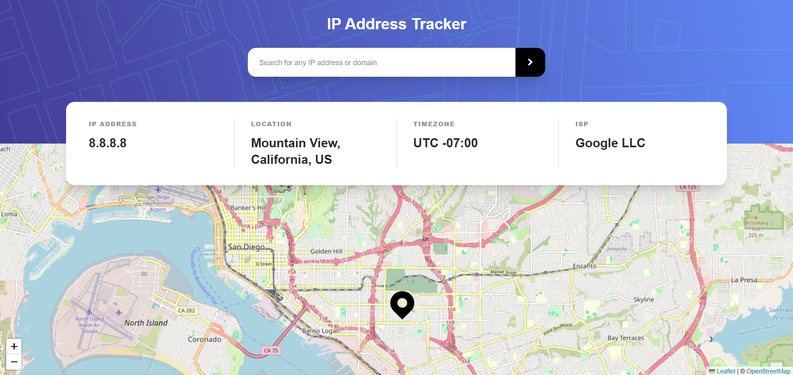
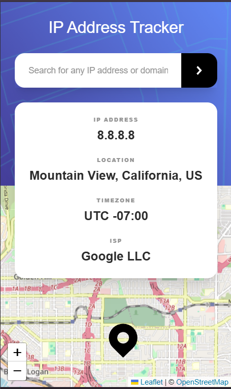

# React + Vite

This template provides a minimal setup to get React working in Vite with HMR and some ESLint rules.

Currently, two official plugins are available:

- [@vitejs/plugin-react](https://github.com/vitejs/vite-plugin-react/blob/main/packages/plugin-react) uses [Babel](https://babeljs.io/) (or [oxc](https://oxc.rs) when used in [rolldown-vite](https://vite.dev/guide/rolldown)) for Fast Refresh
- [@vitejs/plugin-react-swc](https://github.com/vitejs/vite-plugin-react/blob/main/packages/plugin-react-swc) uses [SWC](https://swc.rs/) for Fast Refresh

## React Compiler

The React Compiler is not enabled on this template because of its impact on dev & build performances. To add it, see [this documentation](https://react.dev/learn/react-compiler/installation).# 🛰️ Frontend Mentor - IP Address Tracker Solution

This is my solution to the [IP Address Tracker challenge on Frontend Mentor](https://www.frontendmentor.io/challenges/ip-address-tracker-I8-0yYAH0).  
The goal of this project was to build an interactive IP tracker that displays location data and a live map view using real-time geolocation APIs.

---

## 📑 Table of Contents

- [Overview](#overview)
  - [The challenge](#the-challenge)
  - [Screenshot](#screenshot)
  - [Links](#links)
- [My process](#my-process)
  - [Built with](#built-with)
  - [What I learned](#what-i-learned)
  - [Continued development](#continued-development)
  - [Useful resources](#useful-resources)
- [Author](#author)
- [Acknowledgments](#acknowledgments)

---

## 🚀 Overview

### The challenge

Users should be able to:

- View the optimal layout depending on their device’s screen size
- See hover states for all interactive elements
- View their own IP address and location on the initial page load
- Search any IP address or domain and view detailed location, timezone, and ISP information
- See the queried location pinned on an interactive map

---

### 🖼️ Screenshot

<div style="display:flex; flex-direction: column;  align-items: center; gap: 1rem">


</div>

---

### 🔗 Links

- **Solution URL:** [https://www.frontendmentor.io/challenges/ip-address-tracker-I8-0yYAH0](https://www.frontendmentor.io/challenges/ip-address-tracker-I8-0yYAH0)
- **Live Site URL:** [https://mojtaba-mehrzad.github.io/IP-address-tracker/](https://mojtaba-mehrzad.github.io/IP-address-tracker/)

---

## 🧩 My Process

### ⚙️ Built with

- **[Vite](https://vitejs.dev/)** — lightning-fast React setup
- **[React](https://react.dev/)** — component-based UI library
- **[TailwindCSS](https://tailwindcss.com/)** — utility-first CSS framework
- **[LeafletJS](https://leafletjs.com/)** — for rendering dynamic maps
- **[IP Geolocation API by IPify](https://geo.ipify.org/)** — to fetch location data
- Semantic **HTML5** & modern **CSS**
- Mobile-first responsive workflow
- Custom **React Hooks** for data fetching and validation

---

### 🧠 What I Learned

This project helped me strengthen several key skills in React development and API integration:

1. **Managing async data fetching** with custom hooks:
   - Creating a reusable hook `useIPInfo.js` that handles all API communication, loading states, and error handling.
2. **Secure API key management** with environment variables:
   - Using `.env` and `import.meta.env.VITE_IPIFY_API_KEY` in a Vite setup.
3. **Prop drilling and state synchronization** between components:
   - Ensuring seamless communication between `App.jsx → InfoPanel → Input → useIPInfo`.
4. **Dynamic map rendering** with React Leaflet:
   - Updating map markers and centering based on new IP data.
5. **Robust input validation**:
   - Supporting both IPv4 and IPv6 formats and preventing invalid requests.
6. **Error & loading UX handling**:
   - Clean visual feedback for users during API calls or input validation.

Example code snippet (from `useIPInfo.js`):

```js
useEffect(() => {
  const API_KEY = import.meta.env.VITE_IPIFY_API_KEY;
  const endpoint = ip
    ? `https://geo.ipify.org/api/v2/country,city?apiKey=${API_KEY}&ipAddress=${ip}`
    : `https://geo.ipify.org/api/v2/country,city?apiKey=${API_KEY}`;

  async function fetchIPData() {
    setLoading(true);
    try {
      const res = await fetch(endpoint);
      const json = await res.json();
      setData(json);
    } catch (err) {
      setError(err.message);
    } finally {
      setLoading(false);
    }
  }

  fetchIPData();
}, [ip]);
```

### 📚 Useful Resources

- Documentation for the IP Geolocation API --- [IPify API Docs](https://geo.ipify.org/docs)

- Great for understanding map components and markers --- [React Leaflet Docs](https://react-leaflet.js.org/)

- Utility-first CSS framework reference --- [TailwindCSS Docs](https://tailwindcss.com/docs/installation/using-vite)

## 👤 Author

**_GitHub:_** [@mojtaba-mehrzad](https://github.com/mojtaba-mehrzad)

**_Frontend Mentor:_** [@mojtaba-mehrzad](https://www.frontendmentor.io/profile/mojtaba-mehrzad)

**_Live Site:_** [https://mojtaba-mehrzad.github.io/IP-address-tracker/](https://mojtaba-mehrzad.github.io/IP-address-tracker/)

## 🙌 Acknowledgments

Special thanks to Frontend Mentor for providing such practical challenges,
and to the maintainers of LeafletJS and IPify API for their excellent open-source tools.
This project helped me improve my understanding of React architecture, API-driven UI, and asynchronous state management.
